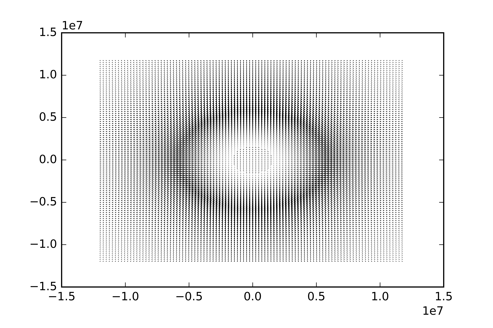
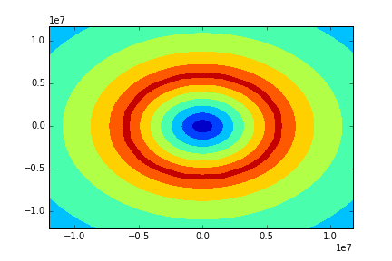
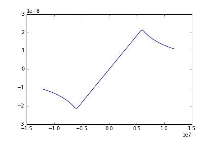

# 各地点における力のベクトルを描画したグラフ

中心から真っすぐ伸びてる(拡大すれば分かる)

# 各地点における力の大きさを描画したグラフ

地球の表面が一番重力が強い

# 真ん中スパっと切って重力をプロットした図

- 地球内部の時
  + 復元力となっていて，大きさは線形に増えてく
- 地球外部の時
  + 非線形となっていって，遠くなれば多分rの2乗に反比例する

# 結論
大学受験のときの「地球にほったトンネルを走る電車」はちゃんと単振動してくれるみたいです．  
ただし，これは2次元での超絶適当なシミュレーションなので3次元でちゃんとやったらどうなるかは知りません．
